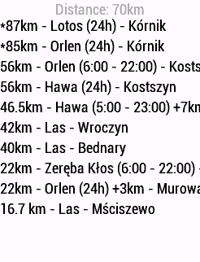

# Race Info - Display distance to points on your way on supported Garmin Bike Computer


When you are on your long race you need to know how far is to one of yours feeding zones, gas stations or shop. At one glance you know if you should stop now, or you can pedal to the the next feeding zone.
1. Install the Race Info app via the Garmin IQ app

2. Create your own POIs with the following format:

```
176km - Start,
163km - Gas Station (24h),
160km - Camp +12km,
152km - Feeding Zone,
0km - Finish
```

3. Send this text via Garmin IQ app to your device

4. Add the Race Info Data Field to your Garmin device screen
   Would behave the best as the single Data Field on your Garmin device screen.

5. Start navigation and see the Race Info on your screen



## Development setup

## Prepareing setup 

You need to create manifest.xml file from template
```
pip install jinja-cli
jinja manifest.xml.j2 > manifest.xml
```

Now you can open the project in [Visual Studio Code with the Monkey C plugin](https://developer.garmin.com/connect-iq/connect-iq-basics/getting-started/).

## Store

Sunch an app needs to be uploaded to [Coonnect IQ Store](https://apps.garmin.com/en-US/developer/dashboard)
